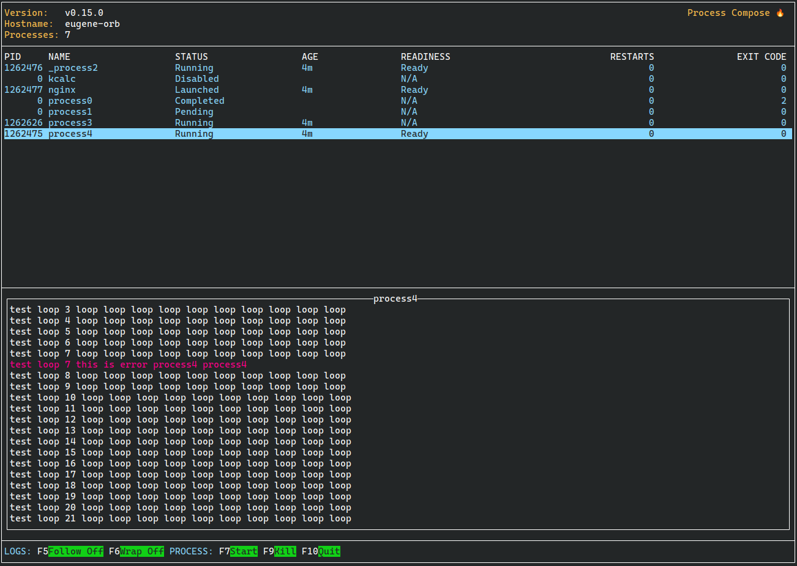
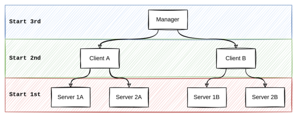
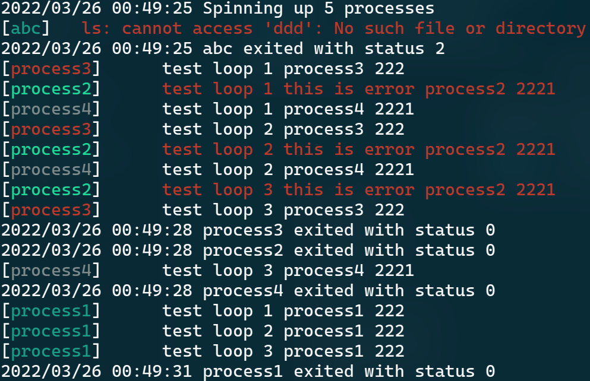
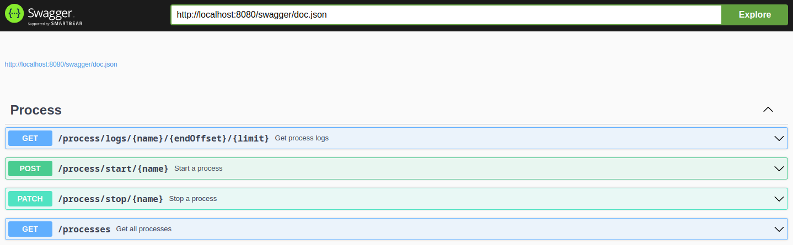

## Process Compose

[](https://go.dev/) [](https://GitHub.com/Naereen/StrapDown.js/graphs/commit-activity) [](http://makeapullrequest.com)  []()

Process Compose is a simple and flexible scheduler and orchestrator to manage non-containerized applications.

**Why?** Because sometimes you just don't want to deal with docker files, volume definitions, networks and docker registries.

#### Features:

- [Processes execution (in parallel or/and serially)](#-launcher)
- [Processes dependencies and startup order](#-define-process-dependencies)
- [Defining recovery policies](#-auto-restart-on-exit)
- [Manual process \[re\]start](#disabled-processes)
- [Processes arguments `bash` or `zsh` style (or define your own shell)](#-linux)
- [Per process and global environment variables](#-environment-variables)
- [Per process or global (single file) logs](#-logger)
- [Health checks (liveness and readiness)](#-health-checks)
- [Terminal User Interface (TUI) or CLI modes](#-tui-terminal-user-interface)
- [Forking (services or daemons) processes](#-background-detached-processes)
- [REST API (OpenAPI a.k.a Swagger)](#-rest-api) 
- [Logs caching](#-review-logs)
- [Functions as both server and client](#-client-mode)
- Configurable shortcuts (see [Wiki](https://github.com/F1bonacc1/process-compose/wiki/Shortcuts-Configuration))

It is heavily inspired by [docker-compose](https://github.com/docker/compose), but without the need for containers. The configuration syntax tries to follow the docker-compose specifications, with a few minor additions and lots of subtractions.



### Quick Start

Imaginary system diagram:



`process-compose.yaml` definitions for the system above:

```yaml
version: "0.5"

environment:
  - "GLOBAL_ENV_VAR=1"
log_location: /path/to/combined/output/logfile.log
log_level: debug

processes:
  Manager:
    command: "/path/to/manager"
    availability:
      restart: "always"
    depends_on:
      ClientA:
        condition: process_started
      ClientB:
        condition: process_started

  ClientA:
    command: "/path/to/ClientA"
    availability:
      restart: "always"
    depends_on:
      Server_1A:
        condition: process_started
      Server_2A:
        condition: process_started
    environment:
      - "LOCAL_ENV_VAR=1"

  ClientB:
    command: "/path/to/ClientB -some -arg"
    availability:
      restart: "always"
    depends_on:
      Server_1B:
        condition: process_started
      Server_2B:
        condition: process_started
    environment:
      - "LOCAL_ENV_VAR=2"

  Server_1A:
    command: "/path/to/Server_1A"
    availability:
      restart: "always"

  Server_2A:
    command: "/path/to/Server_2A"
    availability:
      restart: "always"

  Server_1B:
    command: "/path/to/Server_1B"
    availability:
      restart: "always"

  Server_2B:
    command: "/path/to/Server_2B"
    availability:
      restart: "always"
```

Finally, run `process-compose` in the `process-compose.yaml` directory. Or give it a direct path:

```shell
process-compose -f /path/to/process-compose.yaml
```

### Installation

- Go to the [releases](https://github.com/F1bonacc1/process-compose/releases/latest), download the package for your OS, and copy the binary to somewhere on your PATH.
- If you have the Nix package manager installed with Flake support, just run:

```sh
# to use the latest binary release
nix run nixpkgs/master#process-compose -- --help

# or to compile from the latest source
nix run github:F1bonacc1/process-compose -- --help
```

### Documentation

- See [examples](https://github.com/F1bonacc1/process-compose/tree/main/examples) of workflows for best practices
- See below

#### List of Features and Planned Features

##### ✅ Mostly implemented

##### ❌ Implementation not started (Your feedback and ⭐ will motivate further development 😃)

#### ✅ <u>Launcher</u>

##### ✅ Parallel

```yaml
process1:
  command: "sleep 3"
process2:
  command: "sleep 3"
```

##### ✅ Serial

```yaml
process1:
  command: "sleep 3"
  depends_on:
    process2:
      condition: process_completed_successfully # or "process_completed" if you don't care about errors
process2:
  command: "sleep 3"
  depends_on:
    process3:
      condition: process_completed_successfully # or "process_completed" if you don't care about errors
```

##### ❌ Instance Number

##### ✅ Specify a working directory

```yaml
process1:
  command: "ls -laF --color=always"
  working_dir: "/path/to/your/working/directory"
```

Make sure that you have the proper access permissions to the specified `working_dir`. If not, the command will fail with a `permission denied` error. The process status in TUI will be `Error`.

##### ✅ Define process dependencies

```yaml
process2:
  depends_on:
    process3:
      condition: process_completed_successfully
    process4:
      condition: process_completed_successfully
```

There are 4 condition types that cab be used in process dependencies:

* `process_completed` - is the type for waiting until a process has completed (any exit code)
* `process_completed_successfully` - is the type for waiting until a process has completed successfully (exit code 0)
* `process_healthy` - is the type for waiting until a process is healthy
* `process_started` - is the type for waiting until a process has started (default)

##### ✅ Run only specific processes

For testing and debugging purposes, especially when your `process-compose.yaml` file contains many processes, you might want to specify only a subset of processes to run. For example:

```yaml
#process-compose.yaml
process1:
  command: "echo 'Hi from Process1'"
  depends_on:
    process2:
      condition: process_completed_successfully
process2:
  command: "echo 'Hi from Process2'"      
process3:
  command: "echo 'Hi from Process3'"
```

```bash
process-compose up # will run all the processes - equal to 'process-compose'

#output:
#Hi from Process3
#Hi from Process2
#Hi from Process1
```

```bash
process-compose up process1 process3 # will run 'process1', 'process3' and all of their dependencies - 'process2'

#output:
#Hi from Process3
#Hi from Process2
#Hi from Process1
```

```bash
process-compose up process1 process3 --no-deps # will run 'process1', 'process3' without any dependencies

#output:
#Hi from Process3
#Hi from Process1
```


##### ✅ Termination Parameters

```yaml
nginx:
  command: "docker run --rm --name nginx_test nginx"
  shutdown:
    command: "docker stop nginx_test"
    timeout_seconds: 10 # default 10
    signal: 15 # default 15, but only if the 'command' is not defined or empty
```

`shutdown` is optional and can be omitted. The default behavior in this case: `SIGTERM` is issued to the running process.

In case only `shutdown.signal` is defined `[1..31] ` the running process will be terminated with its value.

In case the `shutdown.command` is defined:

1. The `shutdown.command` is executed with all the Environment Variables of the primary process
2. Wait for `shutdown.timeout_seconds` for its completion (if not defined wait for 10 seconds)
3. In case of timeout, the process will receive the `SIGKILL` signal

##### ✅ Background (detached) Processes

```yaml
nginx:
  command: "docker run -d --rm --name nginx_test nginx" # note the '-d' for detached mode
  is_daemon: true # this flag is required for background processes (default false)
  shutdown:
    command: "docker stop nginx_test"
    timeout_seconds: 10 # default 10
    signal: 15 # default 15, but only if command is not defined or empty
```

1. For processes that start services / daemons in the background, please use the `is_daemon` flag set to `true`. 

2. In case a process is daemon it will be considered running until stopped. 

3. Daemon processes can only be stopped with the `$PROCESSNAME.shutdown.command` as in the example above.

#### ✅ <u>Output Handling</u>

##### ✅ Show process name

##### ✅ Different colors per process

##### ✅ StdErr is printed in Red



##### ❌ Silence specific processes

#### ✅ <u>TUI</u> (Terminal User Interface)

##### ✅ Review processes status

##### ✅ Start processes (only completed or disabled)

##### ✅ Stop processes

##### ✅ Review logs

TUI is the default run mode, but it's possible to disable it:

```shell
./process-compose -t=false
```

Control the UI log buffer size:

```yaml
log_level: info
log_length: 1200 #default: 1000
processes:
  process2:
    command: "ls -R /"
```

**Note**: Using a too large buffer will put a significant penalty on your CPU.

By default `process-compose` uses the standard ANSI colors mode to display logs. However, you can disable it for each process:

```yaml
processes:
  process_name:
    command: "ls -R /"
    disable_ansi_colors: true #default false
```

##### Disabled Processes

Process execution can be disabled:

```yaml
processes:
  process_name:
    command: "ls -R /"
    disabled: true #default false
```

Even if disabled, it is still listed in the TUI and the REST client, can be started manually when needed.

#### ✅ <u>Logger</u>

##### ✅ Per Process Log Collection

```yaml
process2:
  log_location: ./pc.process2.log #if undefined or empty no logs will be saved
```

##### ✅ Capture StdOut output

##### ✅ Capture StdErr output

##### ✅ Merge into a single file

```yaml
processes:
  process2:
    command: "chmod 666 /path/to/file"
environment:
  - "ABC=42"
log_location: ./pc.global.log #if undefined or empty no logs will be saved (if also not defined per process)
```

##### ❌ Silence specific processes

##### ✅ Process compose console log level

```yaml
log_level: info # other options: "trace", "debug", "info", "warn", "error", "fatal", "panic"
processes:
  process2:
    command: "chmod 666 /path/to/file"
```

This setting controls the `process-compose` log level. The processes log level should be defined inside the process. It is recommended to support its definition with an environment variable that can be defined in `process-compose.yaml`

#### ✅ <u>Health Checks</u>

Many applications running for long periods of time eventually transition to broken states, and cannot recover except by being restarted. Process Compose provides liveness and readiness probes to detect and remedy such situations.

Probes configuration and functionality are designed to work similarly to [Kubernetes liveness and readiness probes](https://kubernetes.io/docs/tasks/configure-pod-container/configure-liveness-readiness-startup-probes/).

##### ✅ Liveness Probe

```yaml
  nginx:
    command: "docker run -d --rm -p80:80 --name nginx_test nginx"
    is_daemon: true
    shutdown:
      command: "docker stop nginx_test"
      signal: 15
      timeout_seconds: 5
    liveness_probe:
      exec:
        command: "[ $(docker inspect -f '{{.State.Running}}' nginx_test) = 'true' ]"
      initial_delay_seconds: 5
      period_seconds: 2
      timeout_seconds: 5
      success_threshold: 1
      failure_threshold: 3
```

##### ✅ Readiness Probe

```yaml
  nginx:
    command: "docker run -d --rm -p80:80 --name nginx_test nginx"
    is_daemon: true
    shutdown:
      command: "docker stop nginx_test"
    readiness_probe:
      http_get:
        host: 127.0.0.1
        scheme: http
        path: "/"
        port: 80
      initial_delay_seconds: 5
      period_seconds: 10
      timeout_seconds: 5
      success_threshold: 1
      failure_threshold: 3
```

Each probe type (`liveness_probe` or `readiness_probe`) can be configured in to use one of the 2 mutually exclusive modes:

1. `exec`: Will run a configured `command` and based on the `exit code` decide if the process is in a correct state. 0 indicates success. Any other value indicates failure.
2. `http_get`: For an HTTP probe, the Process Compose sends an HTTP request to the specified path and port to perform the check. Response code 200 indicates success. Any other value indicates failure.
   - `host`: Host name to connect to.
   - `scheme`: Scheme to use for connecting to the host (HTTP or HTTPS). Defaults to HTTP.
   - `path`: Path to access on the HTTP server. Defaults to /.
   - `port`: Number of the port to access on the process. Number must be in the range 1 to 65535.

##### Configure Probes

Probes have a number of fields that you can use to control the behavior of liveness and readiness checks more precisely:

- `initial_delay_seconds`: Number of seconds after the container has started before liveness or readiness probes are initiated. Defaults to 0 seconds. The minimum value is 0.
- `period_seconds`: How often (in seconds) to perform the probe. Defaults to 10 seconds. The minimum value is 1.
- `timeout_seconds`: Number of seconds after which the probe times out. Defaults to 1 second. The minimum value is 1.
- `success_threshold`: Minimum consecutive successes for the probe to be considered successful after failing. Defaults to 1. Must be 1 for liveness and startup Probes. The minimum value is 1. **Note**: this value is not respected and was added as a placeholder for future implementation.
- `failure_threshold`: When a probe fails, Process Compose will try `failure_threshold` times before giving up. Giving up in case of liveness probe means restarting the process. In case of readiness probe, the Pod will be marked Unready. Defaults to 3. The minimum value is 1.

##### ✅ Auto Restart if not Healthy

In order to ensure that the process is restarted (and not transitioned to completed state) in case of readiness check fail, please make sure to define the `availability` configuration. For background (`is_daemon=true`) processes, the `restart` policy should be `always`.

##### ✅ Auto Restart on Exit

```yaml
process2:
  availability:
    restart: on_failure # other options: "exit_on_failure", "always", "no" (default)
    backoff_seconds: 2 # default: 1
    max_restarts: 5 # default: 0 (unlimited)
```

##### ✅ Terminate Process Compose on Failure

There are cases when you would like the `process-compose` to terminate immediately when one of the processes exits with non `0` exit code. This can be useful when you would like to perform "pre-flight" validation checks on the environment.

To achieve that, use `exit_on_failure` restart policy. If defined, `process-compose` will gracefully shut down all the other running processes and exit with the same exit code as the failed process.

```yaml
sanitycheck:
  command: "which go"
  availability:
    restart: "exit_on_failure"

other_proc:
  command: "go test ./..."
  depends_on:
    sanitycheck:
      condition: process_completed_successfuly
```


#### ✅ <u>Environment Variables</u>

##### ✅ Per Process

```yaml
process2:
  environment:
    - "I_AM_LOCAL_EV=42"
```

##### ✅ Global

```yaml
processes:
  process2:
    command: "chmod 666 /path/to/file"
  environment:
    - "I_AM_LOCAL_EV=42"
environment:
  - "I_AM_GLOBAL_EV=42"
```

Default environment variables:

`PC_PROC_NAME` - Defines the process name as defined in the `process-compose.yaml` file.

`PC_REPLICA_NUM` - Defines the process replica number. Useful for port collision avoidance for processes with multiple replicas.

#### ✅ <u>REST API</u>

A convenient Swagger API is provided: http://localhost:8080



Default port is 8080. Specify your own port:

```shell
process-compose -p PORT
```

#### ✅ Client Mode

Process compose can also connect to itself as client. Available commands:

##### Processes List

```shell
process-compose process list #lists available processes
```

##### Process Start

```shell
process-compose process start [PROCESS] #starts one of the available non running processes
```

##### Process Stop

```shell
process-compose process stop [PROCESS] #stops one of the running processes
```

##### Process Restart

```shell
process-compose process restart [PROCESS] #restarts one of the available processes
```

Restart will wait `process.availability.backoff_seconds` seconds between `stop` and `start` of the process. If not configured the default value is 1s.

By default the client will try to use the default port `8080` and default address `localhost` to connect to the locally running instance of process-compose. You can provide deferent values:

```shell
process-compose -p PORT process -a ADDRESS list
```


#### ✅ <u>Configuration</u>

##### ✅ Support .env file

##### ✅ Override ${var} and $var from environment variables or .env values

##### ❌ Merge 2 or more configuration files with override values

##### ✅ Specify which configuration files to use

```shell
process-compose -f "path/to/process-compose-file.yaml"
```

##### ✅ Auto discover configuration files

The following discovery order is used: `compose.yml, compose.yaml, process-compose.yml, process-compose.yaml`. If multiple files are present the first one will be used.

#### ✅ <u>Multi-platform</u>

##### ✅ Linux

The default backend is `bash`. You can define a different backend with a `COMPOSE_SHELL` environment variable.

##### ✅ Windows

The default backend is `cmd`. You can define a different backend with a `COMPOSE_SHELL` environment variable.

```yaml
process1:
  command: "python -c print(str(40+2))"
  #note that the same command for bash/zsh would look like: "python -c 'print(str(40+2))'"
```

Using `powershell` backend had some funky behaviour (like missing `command1 && command2` functionality in older versions). If you need to run powershell scripts, use the following syntax:

```yaml
process2:
  command: "powershell.exe ./test.ps1 arg1 arg2 argN"
```

##### ✅ macOS

The default backend is `bash`. You can define a different backend with a `COMPOSE_SHELL` environment variable.

##### ✅ Configurable Backend

For cases where you process compose requires a non default or transferable backend definition, setting an environment variable won't do. For that you  can configure it directly in the `process-compose.yaml` file:

```yaml
version: "0.5"
shell:
  shell_command: "python3"
  shell_argument: "-m"
processes:
	http:
		command: "server.py"
```

**Note**: please make sure that the `shell.shell_command` value is in your `$PATH`

## How to Contribute

1. Fork it
2. Create your feature branch (git checkout -b my-new-feature)
3. Commit your changes (git commit -am 'Add some feature')
4. Push to the branch (git push origin my-new-feature)
5. Create new Pull Request

English is not my native language, so PRs correcting grammar or spelling are welcome and appreciated.
