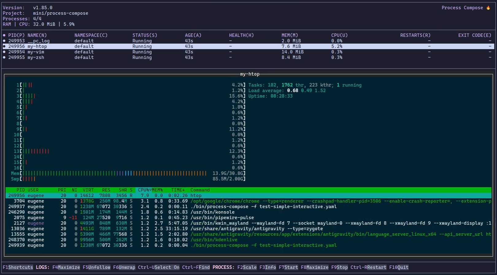

---
date:
    created: 2025-12-06
tags:
    - interactive
    - tui
    - workflow
---

# Interactive Processes Are Here 🎉 (v1.85.0)



One of the most requested features is finally in Process Compose — interactive processes.

Until now, Process Compose was great at managing and observing your processes, but it was strictly a spectator. If you needed to poke at a running REPL, step through a debugger, or interact with a CLI tool, you had to work around it. Not anymore.

## What's new?

With `is_interactive: true`, Process Compose will allocate a pseudo-terminal (PTY) for your process and let you talk to it directly from the TUI. No detours, no workarounds.

```yaml
processes:
  my-repl:
    command: "python3"
    is_interactive: true
```

That's all the config you need.

## How it feels to use

Select your interactive process in the TUI like you normally would — you'll see its output in the logs view. When you're ready to actually *type into it*, hit `TAB` to switch focus to the terminal. Now you're in. Type away.

When you're done and want to get back to navigating Process Compose, press `CTRL+A` then `ESC` to hand control back to the TUI.

You can also scroll back through the process history using the mouse wheel or `CTRL+A` + arrow keys, and hit `ESC` to jump back to live output.

---

It's a small addition in terms of config, but it opens up a whole new category of workflows. Run your database console, your Node REPL, your interactive debugger — all without leaving Process Compose.

Give it a try and let me know what you think!
