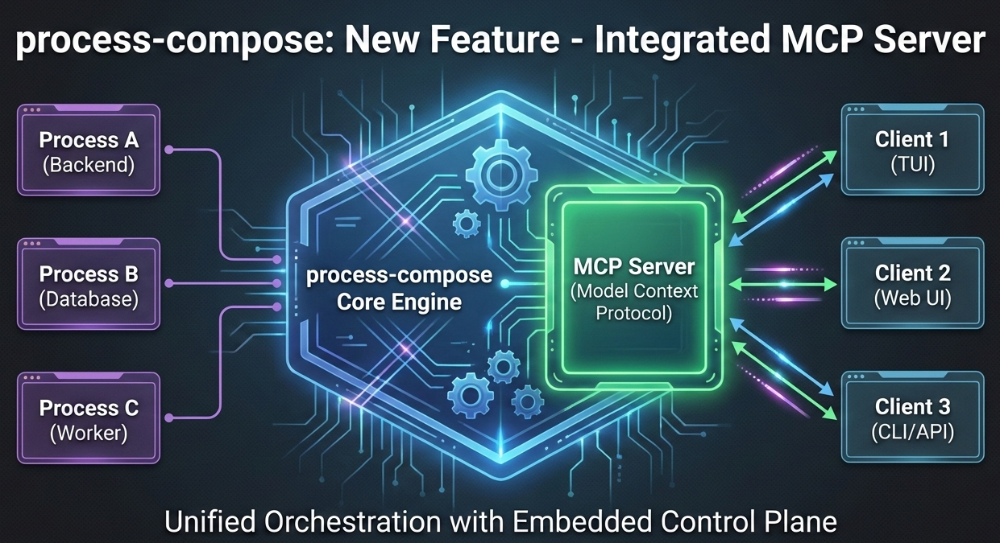

---
date:
    created: 2026-02-21
tags:
    - mcp
    - ai
    - devops
    - workflow
---

# Embedded MCP Server Support in process-compose (v1.94.0)



Process-compose now includes embedded MCP (Model Context Protocol) server support. This allows you to expose your existing processes as tools or resources that AI assistants can invoke directly.

## Why MCP?

The Model Context Protocol (MCP) provides a standard way to connect AI assistants to external tools. Typically, adding MCP support means writing a dedicated wrapper in Python, TypeScript, or Go.

With process-compose, you can bypass the SDKs. If you can define a shell command in your `process-compose.yaml`, you can expose it to an AI client like Claude, Cursor, or vs-code.

## Configuration

Enable the MCP server by adding an `mcp_server` section. You can use either `sse` (HTTP) or `stdio` transport.

```yaml
mcp_server:
  host: localhost
  port: 3000
  transport: sse # Use 'stdio' for IDE integrations like Cursor

processes:
  list-files:
    command: "ls -R @{directory}"
    description: "List files recursively"
    disabled: true # MCP processes must be disabled initially
    mcp:
      type: tool
      arguments:
        - name: directory
          type: string
          description: "Directory to list"
          required: true
```

## Use Cases

### 1. Developer Tooling as AI Tools

Turn your local scripts, Docker commands, or Kubernetes operations into AI-accessible resources without writing any new code.

```yaml
processes:
  generate-report:
    command: "python reports/generate.py @{report_type} @{date_range}"
    description: "Generate report"
    mcp:
      type: tool
      arguments:
        - name: report_type
          type: string
          description: "Type of report (sales, users, performance)"
        - name: date_range
          type: string
          description: "Date range in YYYY-MM-DD:YYYY-MM-DD format"
```

You're not locked into any language. Python ML tools, Rust performance tools, Node.js API wrappers, bash scripts—they all coexist in one MCP server.

### 2. Your Development Environment as an AI Copilot

I spend half my day debugging local services. "Why isn't the auth service working?" usually means checking logs, restarting containers, hitting health endpoints. Now AI can do that:

```yaml
processes:
  restart-service:
    command: "docker-compose restart @{service_name}"
    description: "Restart service"
    mcp:
      type: tool
      arguments:
        - name: service_name
          type: string
          description: "Name of the service to restart"
      
  check-health:
    command: "curl -s http://localhost:@{port}/health | jq"
    mcp:
      type: tool
      arguments:
        - name: port
          type: integer
          description: "Port number of the service"
      
  get-logs:
    command: "docker logs @{container} --tail @{lines}"
    mcp:
      type: tool
      arguments:
        - name: container
          type: string
          description: "Container name"
        - name: lines
          type: integer
          description: "Number of log lines to retrieve"
```

Now I can tell Claude: "My authentication service isn't responding, can you check what's wrong?" and it can actually diagnose the issue by checking health, reading logs, and restarting services if needed.

### 3. Living Infrastructure Documentation

Runbooks get outdated. Documentation drifts. But with MCP + process-compose, your operations become self-documenting:

```yaml
processes:
  scale-deployment:
    command: "kubectl scale deployment @{service} --replicas=@{replicas}"
    mcp:
      type: tool
      arguments:
        - name: service
          type: string
          description: "Name of the Kubernetes deployment to scale"
        - name: replicas
          type: integer
          description: "Target number of replicas (1-10 for production)"
          
  check-pod-status:
    command: "kubectl get pods -l app=@{app_name} -o json | jq '.items[] | {name: .metadata.name, status: .status.phase}'"
    mcp:
      type: tool
      arguments:
        - name: app_name
          type: string
          description: "Application name label"
```

AI automatically knows what operations exist, what they do, and how to use them. The configuration IS the documentation.

### 4. Giving AI Read-Only Access (Resources)

Sometimes you don't want the AI to do things, you just want it to see things. In MCP, these are called Resources.

`process-compose` makes it trivial to pipe system stats or database queries into the AI's context window.

```yaml
processes:
  get-active-users:
    command: "psql -c 'SELECT user_id, email, last_login FROM users WHERE active=true' -t -A -F',' | jq -Rs 'split(\"\n\")[:-1] | map(split(\",\") | {user_id: .[0], email: .[1], last_login: .[2]})'"
    mcp:
      type: resource
      
  get-system-metrics:
    command: "top -bn1 | head -20"
    mcp:
      type: resource
      
  get-disk-usage:
    command: "df -h | grep -v tmpfs | tail -n +2"
    mcp:
      type: resource
```

AI can now query your databases, check system status, read configuration—all without custom API wrappers.

### 5. Legacy System Integration

This one's close to my heart. Every company has that 20-year-old system with a CLI but no API. Making it AI-accessible used to mean a major rewrite. Not anymore:

```yaml
processes:
  legacy-report:
    command: "java -jar legacy-reporter.jar --user @{user} --format json --filter '@{filter}'"
    mcp:
      type: tool
      arguments:
        - name: user
          type: string
          description: "Username for legacy system"
        - name: filter
          type: string
          description: "Report filter criteria"
          
  mainframe-query:
    command: "expect scripts/mainframe-query.exp @{QUERY_STRING}"
    mcp:
      type: tool
      arguments:
        - name: query_string
          type: string
          description: "Query to execute on mainframe"
```

Bridge decades-old systems to cutting-edge AI without touching the legacy code.

### 6. Complex Multi-Step Workflows

Here's where `process-compose` really shines. You already have dependency management, so orchestrated AI workflows just work:

```yaml
processes:
  run-tests:
    command: "pytest tests --json-report --json-report-file=report.json"
    mcp:
      type: tool
      
  build-docker:
    command: "docker build -t myapp:@{tag} ."
    depends_on:
      run-tests:
        condition: process_completed_successfully
    mcp:
      type: tool
      arguments:
        - name: tag
          type: string
          description: "Docker image tag"
      
  push-to-registry:
    command: "docker push myapp:@{tag}"
    depends_on:
      build-docker:
        condition: process_completed_successfully
    mcp:
      type: tool
      arguments:
        - name: tag
          type: string
          description: "Docker image tag to push"
```

Tell AI: "Run tests, and if they pass, build and push version 2.3.1" and it orchestrates the entire CI/CD pipeline.

### 7. Personal Automation Hub

Everyone has their own scripts. Now they can be AI-accessible:

```yaml
processes:
  backup-photos:
    command: "rsync -av ~/Photos/ backup-server:/photos/ && echo '{\"status\": \"success\", \"files_copied\": '$(rsync -av --dry-run ~/Photos/ backup-server:/photos/ | grep -c 'uptodate')'}}'"
    mcp:
      type: tool
      
  organize-downloads:
    command: "python ~/scripts/organize_downloads.py @{folder} --output-format json"
    mcp:
      type: tool
      arguments:
        - name: folder
          type: string
          description: "Folder path to organize"
      
  check-disk-space:
    command: "df -h / | tail -1 | awk '{print \"{\\\"filesystem\\\":\\\"\" $1 \"\\\",\\\"size\\\":\\\"\" $2 \"\\\",\\\"used\\\":\\\"\" $3 \"\\\",\\\"available\\\":\\\"\" $4 \"\\\",\\\"percent\\\":\\\"\" $5 \"\\\"}\"}'"
    mcp:
      type: resource
```

"Hey Claude, backup my photos and let me know if I'm running low on disk space."

## Why This Works So Well

The magic is that process-compose already handles the heavy lifting required for MCP:

- Process lifecycle management
- Output capture and buffering
- Error handling and exit codes
- Environment variable injection
- Dependency orchestration
- Logging and observability
- Health checks and monitoring

We're just exposing these capabilities through the MCP protocol. The integration is surprisingly thin because the foundations were already solid.

## What Makes This Different

- **Lowest barrier to entry**: If you can write a shell command, you can create MCP tools. No SDK to learn.
- **Language agnostic**: Python, Rust, Go, Node.js, bash, legacy Java—they all work together seamlessly.
- **Production ready**: You get all of process-compose's production features (logging, health checks, restart policies) for free.
- **Rapid iteration**: Change a script, reload the config, test immediately. Process-compose's hot-reload works for MCP tools too.
- **No vendor lock-in**: Standard MCP protocol means compatibility with future AI assistants, and any MCP client.
- **Leverage existing work**: All your scripts, tools, and automation become AI-accessible without rewriting.

## Technical Details

For those interested in the implementation, here's how it works:

- Single embedded MCP server using `github.com/mark3labs/mcp-go`
- Supports both `STDIO` and `SSE` transports
- Tool arguments are validated against declared types (string, number, boolean, integer)
- Processes start on-demand and shut down after completion
- Output captured via process-compose's existing buffer mechanism
- Standard MCP error handling for non-zero exit codes

The configuration is validated at startup, so you catch issues early.

## Try It Yourself

1. Add `mcp_server` config to your process-compose YAML
2. Add `mcp` sections to processes you want to expose
3. Start process-compose
4. Connect any MCP client

That's it. Your scripts are now AI-callable tools.

I built process-compose to simplify orchestration. This integration is the logical next step: making that orchestration accessible not just to humans, but to the agents helping us work.

I can't wait to see what you build with it.

---

If you want to follow development or contribute, check out the [process-compose](https://github.com/F1bonacc1/process-compose). Issues and PRs welcome!

---

*What tools would you expose via MCP? What problems would this solve for you? Let me know in the comments or on GitHub.*
